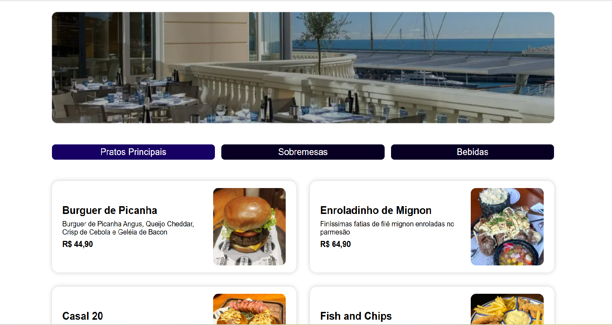

# 🍽️ Cardápio de Restaurante



O **Cardápio de Restaurante** é uma aplicação web desenvolvida em **React** que apresenta um **cardápio digital dinâmico** para restaurantes.  
O projeto simula a experiência de um menu moderno com **categorias filtráveis**, **cards ilustrados** e **preços visíveis**, proporcionando uma navegação intuitiva e agradável para os usuários.

---

## 🚀 Funcionalidades

- **Banner de destaque** com a identidade visual do restaurante.  
- **Categorias interativas** (Pratos Principais, Sobremesas e Bebidas), controladas por estado e filtráveis com um clique.  
- **Listagem dinâmica de cards**, exibindo imagens, descrições e preços de forma organizada.  
- **Interface responsiva**, adaptando-se automaticamente a diferentes tamanhos de tela.  

---

## 🛠️ Tecnologias utilizadas

- [React 19](https://react.dev/) — Utilização de hooks como `useState` para controle de estado.  
- [Vite](https://vitejs.dev/) — Ferramenta de build e desenvolvimento rápido.  
- **CSS moderno** — Uso de Grid, Flexbox e Media Queries para layout e responsividade.

---

## 📁 Estrutura de pastas
```bash
cardapio-restaurante/
├── src/
│ ├── App.jsx # Componente raiz que organiza o banner, categorias e cards
│ ├── App.css # Estilos globais da aplicação
│ ├── main.jsx # Ponto de entrada que renderiza o App no DOM
│ ├── assets/
│ │ ├── cardapio.js # Dados estruturados do cardápio (pratos, sobremesas e bebidas)
│ │ └── ... # Imagens utilizadas nos cards e no banner
│ └── components/
│ ├── Banner.jsx # Componente responsável pela imagem de destaque
│ ├── Categorias.jsx # Lista e controla a categoria selecionada
│ ├── Cards.jsx # Recebe os itens filtrados e renderiza a grade de cards
│ └── Card.jsx # Estrutura visual de cada item do cardápio
├── index.html # Template HTML servido pelo Vite
└── vite.config.js # Configuração do Vite
```

---

## 🧩 Executando o projeto localmente

1. **Instale as dependências:**
   ```bash
   npm install
2. **Inicie o servidor de desenvolvimento:**
   ```bash
   npm run dev

---

## 🎨 Estilos e responsividade

- **O layout principal utiliza CSS Grid para dispor categorias e cards com espaçamento uniforme.

- **Os cards mostram imagem e texto lado a lado em telas maiores e se adaptam a uma única coluna em telas menores que 900px.

- **Media Queries adicionais ajustam espaçamento e disposição das categorias para telas abaixo de 640px.
